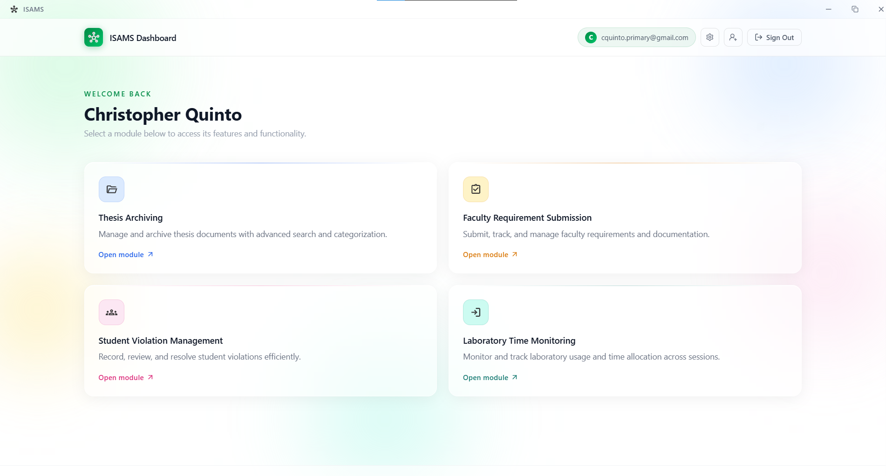

# Integrated Smart Academic Management System (ISAMS)

## About The Project

The Integrated Smart Academic Management System (ISAMS) is a comprehensive, centralized platform built specifically for the College of Computer Studies (CCS) at Pamantasan ng Lungsod ng Pasig (PLP). Designed to modernize and streamline daily academic operations, ISAMS eliminates inefficiencies and brings clarity, organization, and transparency to college administration.

From tracking faculty requirements and student progress to archiving crucial academic work, ISAMS acts as the digital backbone of the college. By consolidating disparate workflows into a single, intuitive interface, we empower educators and administrators to focus less on paperwork and more on student success.

## Key Features

* **Centralized Dashboard and Analytics**
  Gain immediate, real-time insights into college operations through sophisticated data visualization and reporting tools. Monitor key metrics at a glance to make informed, data-driven decisions.

* **Thesis Archiving and Management**
  A secure, structured repository for academic research. Easily store, organize, and retrieve thesis documents, ensuring that valuable student contributions are preserved and accessible for future reference.

* **Faculty Requirement Tracking**
  Simplify administrative compliance by digitizing the submission and review of faculty requirements. Automated tracking ensures that all necessary documentation is collected promptly and securely.

* **Class and Student Management**
  Maintain up-to-date class lists, track student violations, and monitor academic standing in one unified system. ISAMS provides a clear overview of student records, making disciplinary and academic tracking straightforward.

* **Laboratory Time Monitoring**
  Optimize the use of campus facilities with precise tracking of laboratory schedules and utilization. This ensures fair access to resources while maintaining strict oversight of equipment and laboratory time.

## Built For the Future

ISAMS is a forward-thinking solution engineered to reduce administrative overhead. By delivering a fast, responsive, and highly secure environment, ISAMS ensures that the College of Computer Studies operates at peak efficiency. 

---

## Technical Stack

For the development community and technical maintainers, ISAMS is built on a modern, robust, and scalable architecture. 

**Frontend:**
* React 19
* Vite
* Tailwind CSS 4
* Radix UI
* AG-Grid (for advanced data tables)
* Recharts (for analytics and data visualization)

**Desktop Environment:**
* Tauri (Rust-based secure desktop wrapper)

**Backend & Infrastructure:**
* Supabase (PostgreSQL Database, Authentication, and Storage)
* Node.js / Express (Server-side processing and tasks)

**Utilities & Integrations:**
* Lucide React (Iconography)
* jsPDF (Automated PDF report generation)
* XLSX (Excel document parsing and processing)
* Tesseract.js (Optical Character Recognition / OCR)

## Architecture Overview

* **Feature-Based Modularity:** The codebase is organized by domain (Authentication, Class Management, Laboratory Monitoring, etc.), ensuring high maintainability and scalable feature additions.
* **Separation of Concerns:** Business logic is abstracted into custom React hooks, while direct database interactions are isolated in dedicated service layers.
* **Security & Performance:** Leveraging Tauri for the desktop client ensures native performance with enhanced security, paired with Supabase's secure infrastructure and database policies.
